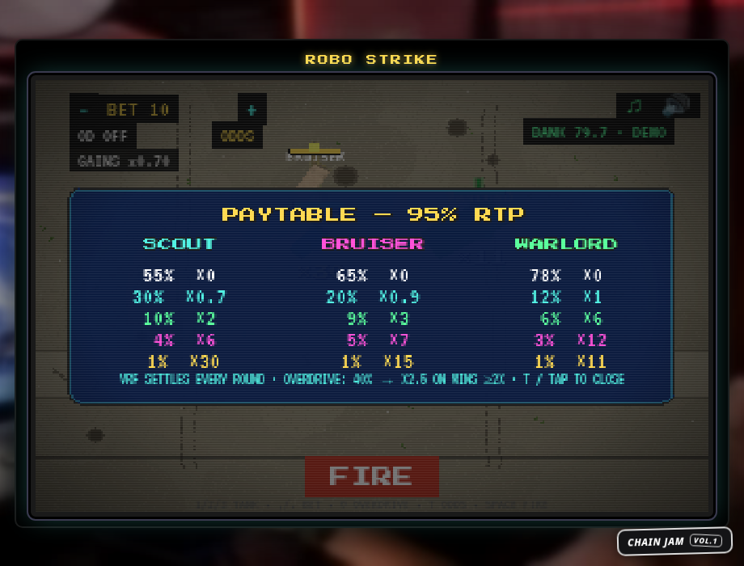

<div align="center">

# 🎖️ ROBO STRIKE

### *Retro Tank Casino · Chain Jam Vol. 1*

**Pick your volatility. FIRE. VRF decides.**

[](docs/MATH.md)
[](docs/MATH.md)
[](https://phaser.io)
[](https://www.typescriptlang.org)
[](LICENSE)

**[▶ PLAY NOW](https://robo-strike.robo-strike.workers.dev)**

*No wallet. No install. Opens straight into a playable demo.*

</div>

---

<div align="center">



*In-game paytable: exact odds per tank, derived from the paytable source*

</div>

---

## 🎮 The game

You command a **T-34** in a live CRT arena against three enemy machines.
Set your bet, pick your target, hit **FIRE**. Chain VRF settles the round
instantly: miss, glance, solid hit, crit, or jackpot.

Your pick is a **volatility choice, not skill**. Tank movement and return
fire are pure presentation and never touch a payout. Press **T** any time
for the in-game paytable with exact odds. Session stats, biggest win, and
win streaks persist between visits, cosmetic only, VRF stays the sole
authority.

## 🎯 Pick your tank

| | Tank | Machine | Volatility | Paytable (chance × payout) | RTP |
|---|---|---|---|---|---|
| 🟦 | **SCOUT** | Pz.Kpfw. IV | Low | 55%×0 · 30%×0.7 · 10%×2 · 4%×6 · **1%×30** | 95% |
| 🟨 | **BRUISER** | Tiger II | Medium | 65%×0 · 20%×0.9 · 9%×3 · 5%×7 · **1%×15** | 95% |
| 🟩 | **WARLORD** | KV-2 | High | 78%×0 · 12%×1 · 6%×6 · 3%×12 · **1%×11** | 95% |

### ⚡ OVERDRIVE

Optional gamble, arm it with `O` before firing. On wins of 2× or more:
**40% chance to multiply the win ×2.5**, else the win is lost.

`0.4 × 2.5 = 1.0` exactly. EV-neutral for every strategy, so RTP stays
95% however you use it.

---

## 🛡️ Provably fair

| Guarantee | How |
|---|---|
| **Exactly 19/20 RTP** on every tank | Rational proof in [`docs/MATH.md`](docs/MATH.md), asserted with integer math in tests |
| **Unbiased outcomes** | BigInt thresholds `Tᵢ = floor(bᵢ·2²⁵⁶/100)`, full partition of `[0, 2²⁵⁶)`, zero modulo bias |
| **No rigging path** | No `Math.random` in the outcome code (CI enforced: `npm run lint:rng`) |
| **Simulated** | `npm run sim:rtp`: 1M rounds per tank, all profiles PASS |
| **On-chain verified** | 60 simulator rounds matched the TypeScript math exactly, 0 mismatches |

Contract mirror: [`contracts/RoboStrike.sol`](contracts/RoboStrike.sol) holds the
same thresholds as literals (CI asserted equal), compiled with solc 0.8.36.

---

## 🕹️ Controls

| Key | Action |
|---|---|
| `1` `2` `3` / click a tank | Pick volatility |
| `,` `.` | Bet down / up |
| `O` | Overdrive on / off |
| `T` | Paytable panel |
| `SPACE` `ENTER` FIRE | Fire |
| `WASD` arrows click | Move (cosmetic) |
| `M` `N` | Music / SFX toggles |

Touch supported: tap tanks and buttons.

---

## 🧑‍💻 Run it

```sh
npm install
npm run dev        # standalone demo at :5173 (mock bank, crypto-RNG outcomes)
npm test           # 63 tests: paytable math, ABI, bridge, manifest, session
npm run sim:rtp    # 1M-round RTP gate, exit 1 on fail
npm run compile:sol  # solc compile gate for contracts/
npm run budget     # wire-size gate, max 1.2MB gz
npm run gen:bg      # regenerate the procedural battlefield
npm run sim:roundtrip  # on-chain rounds vs TS math (needs local stack)
npm run sim:stuck   # stuck-randomness recovery test
npm run build      # production build to dist/
```

Chain Casino SDK deliverables:

| Deliverable | Path |
|---|---|
| Contract (`ICasinoGameV2`, instant pattern) | `contracts/RoboStrike.sol`, vendored `contracts/ICasinoGameV2.sol` |
| Static frontend (bridge guest, no wallet code) | `src/`, bridge in `src/game/sdk/` |
| Manifest (same origin, validator passed) | `public/game.manifest.json` |

---

## 🚀 Deploy

```sh
npm run build && npx wrangler deploy   # Cloudflare Workers (primary, live)
npx vercel --prod                      # Vercel (mirror, not yet deployed)
```

`game.manifest.json` is served same-origin with the game. The jam widget
(`https://jam.chain.wtf/widget.js`) is embedded in `index.html`.
Initial wire is about **746 KB gz**, music lazy-loads after boot.

---

## 🎨 Assets and licenses

All artwork and audio are commercial-safe. Full per-file inventory with
source URLs: [`docs/ASSET_INVENTORY.md`](docs/ASSET_INVENTORY.md).

Tank sprites: **"Tanks" by Bleed ([opengameart.org](https://opengameart.org/content/tank-pack-bleeds-game-art)), CC-BY 3.0, modified**
(cropped, recolored, downscaled). Fonts: Press Start 2P and VT323 (OFL 1.1).
SFX and music: CC0 (OGA, Freesound, Pixabay).

---

<div align="center">

**ROBO STRIKE · pick your tank · FIRE · 95% RTP**

*Built for Chain Jam Vol. 1. Volatility is a choice, luck does the rest.*

</div>
