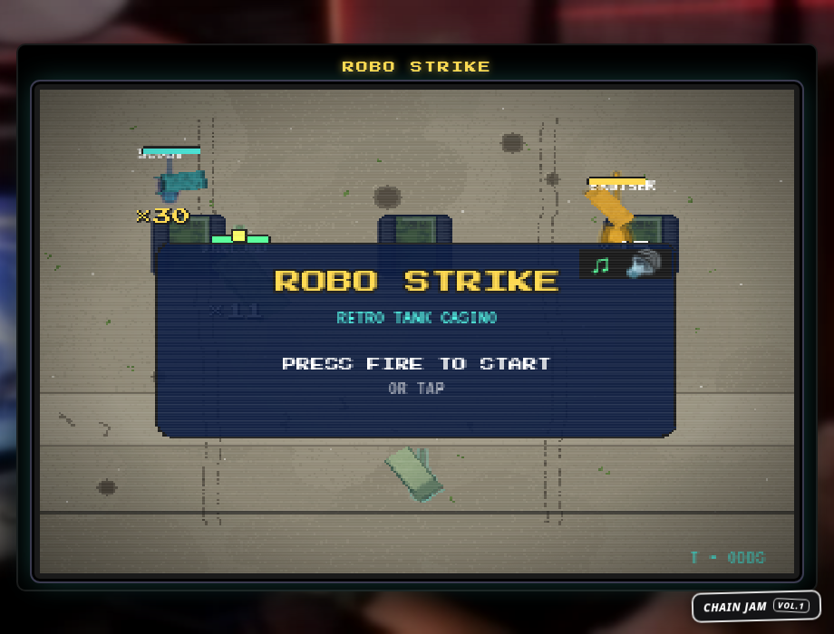
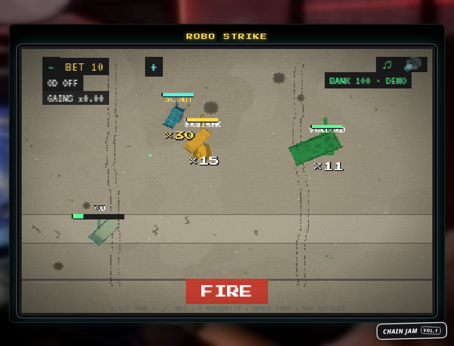

# ROBO STRIKE: Retro Tank Casino (Chain Jam Vol. 1)

> Retro CRT tank casino: pick your volatility, fire, VRF decides. 95% RTP, 30x jackpots.

**Play:** https://robo-strike.robo-strike.workers.dev
**Stack:** Phaser 3.80, Vite 5, TypeScript 5.5, Chain Casino SDK (`ICasinoGameV2`)

## The game

Command a WW2 tank in a CRT arena. Set your bet, pick 1 of 3 enemy tanks, and FIRE.
Your pick is a volatility choice, not skill: Chain VRF settles every round instantly.
Tank movement and return fire are presentation only and never affect a payout.
Press **T** for the in-game paytable with exact odds per tank. Session stats, biggest
win, and win streaks persist between visits. They are cosmetic and never touch the
VRF path.




| Tank | Volatility | Paytable (probability x multiplier) | RTP |
|------|-----------|--------------------------------------|-----|
| SCOUT | low | 55%x0, 30%x0.7, 10%x2, 4%x6, 1%x30 | 95% |
| BRUISER | medium | 65%x0, 20%x0.9, 9%x3, 5%x7, 1%x15 | 95% |
| WARLORD | high | 78%x0, 12%x1, 6%x6, 3%x12, 1%x11 | 95% |

**OVERDRIVE** (optional, toggle with `O` before firing): on wins of 2x or more, a 40%
chance to multiply the win by 2.5, else the win is lost. `0.4 x 2.5 = 1.0` exactly,
so it is EV-neutral and RTP stays 95% however you use it.

## Math and fairness

- **RTP is exactly 19/20 on every tank.** Rational proof in `docs/MATH.md`, asserted
  with integer arithmetic in `tests/paytables.test.ts`.
- **Outcomes are unbiased BigInt thresholds**: `T_i = floor(b_i * 2^256 / 100)`,
  first `i` with `v < T_i` wins. Full partition of `[0, 2^256)`: no gaps, no modulo
  bias, no `Math.random` in the outcome path (enforced by `npm run lint:rng`).
- **Verified by simulation**: `npm run sim:rtp` plays 1M rounds per tank with seeded
  splitmix64 words and asserts RTP within 93-98, within 0.5pp of 95, per-bucket
  frequencies within 0.3pp, and Overdrive EV = 1.0. Non-zero exit on any failure.
- **Contract mirror**: `contracts/RoboStrike.sol` stores the same thresholds as
  literals, asserted equal to the TypeScript (`npm test`), compiled with solc 0.8.36
  (`npm run compile:sol`).
- **Verified on-chain**: 60 simulator rounds with payouts exactly equal to the
  TypeScript math, plus the full bet to reveal flow through the real SDK bridge
  in the official simulator harness (`scripts/harness-e2e.mjs`).

## Deliverables (Chain Casino SDK)

| Deliverable | Path |
|-------------|------|
| Contract (`ICasinoGameV2`, instant pattern) | `contracts/RoboStrike.sol` and vendored `contracts/ICasinoGameV2.sol` |
| Static frontend (bridge guest, no wallet code) | `src/`, bridge in `src/game/sdk/` (penpal), `CasinoSession` orchestrator |
| Manifest (same origin, validator-passed) | `public/game.manifest.json` |

```sh
npm install
npm run dev        # standalone demo at :5173 (mock bank, crypto-RNG outcomes)
npm test           # 63 vitest suites: paytable math, ABI, bridge, manifest, session
npm run sim:rtp    # 1M-round RTP gate, exit 1 on fail
npm run compile:sol  # solc compile gate for contracts/
npm run budget     # wire-size gate, max 1.2MB gz
npm run gen:bg      # regenerate the procedural battlefield
npm run sim:roundtrip  # on-chain rounds vs TS paytable math (needs local stack)
npm run sim:stuck   # stuck-randomness recovery test (cancel past deadline, refund)
npm run build      # production build to dist/
```

Local casino simulator (full wager round-trips): see `vendor/casino-sdk`
(gitignored SDK checkout). Start it, drop `contracts/RoboStrike.sol` into
`simulator/contracts/`, and the watcher deploys and registers it.

## Controls

`1/2/3` or click a tank: pick volatility. `,`/`.`: bet down/up. `O`: Overdrive.
`T`: paytable panel. `SPACE`/`ENTER`/FIRE button: fire.
`WASD`/arrows/click: move (cosmetic). `M`/`N`: music/SFX toggles.
Touch: tap tanks and buttons.

## Assets and licenses

All assets are commercial-safe. Full per-file inventory with source URLs is in
`docs/ASSET_INVENTORY.md`. Tank sprites are Bleed's WW2 top-down tank pack
([OGA](https://opengameart.org/content/tank-pack-bleeds-game-art)), **CC-BY 3.0**.
Attribution: "Tanks" by Bleed (opengameart.org), CC-BY 3.0, modified
(cropped, recolored, downscaled). Fonts: Press Start 2P and VT323 (OFL 1.1).
SFX and music: CC0 (OGA, Freesound, Pixabay).

## Deploy

- **Primary:** Cloudflare Workers static assets:
  `npm run build && npx wrangler deploy` (`wrangler.toml` configured,
  `not_found_handling = "404-page"` so the manifest is never shadowed).
- **Mirror:** Vercel: `npx vercel --prod` (`vercel.json` configured, no SPA rewrite).
- `game.manifest.json` is served same-origin at `/game.manifest.json` on both
  (SDK `assertSameOriginUrls`).
- The jam widget (`https://jam.chain.wtf/widget.js`) is embedded in `index.html`.

## Load budget

Initial wire is about **746 KB gz** (JS plus sprites plus SFX plus html/manifest).
The music loop lazy-loads after boot (`npm run budget` gates this).
